#Python API (2&3) Tutorial

## Author

Keyuan Yin

## Change Log

|Version|Author|Note|  
|---|---|---|
|1|Keyuan Yin|First Created in Feb. 2017|
|2|Keyuan Yin|Updated family 8's member|
|3|Ramiro Marco Figuera|Updated January 2018|

## Introduction

Python API for planet server serves the function of creating band images developed by Anik Halder, Ramiro Marco Figuera under Python 3.5 environment and Python 2.7 environment.  

## Family Introduction

This part introduces you the CRISM products grouped by families included in this Python API.  

#### Family 1

This family has associated Product # of following : 13, 19, 20, 21, 23, 27, 28, 29, 31, 33, 34, 36, 37, 39, 44, 46, 47, 48, 57.  

#### Family 2

The formula goes as following:  

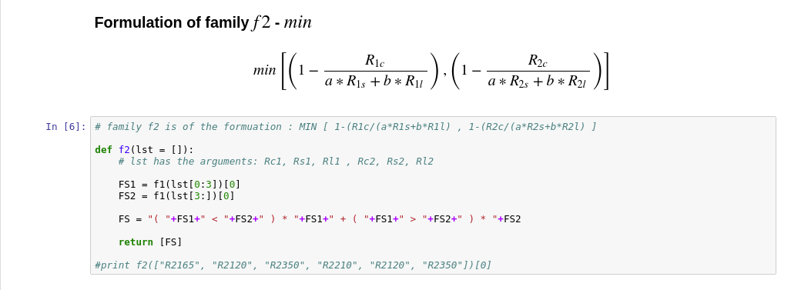

Associated members are MIN2200, MIN2250, MIN2295_2480 and MIN2345_2537

#### Family 3

Only one member in the list belongs to this family, BD1900_2.

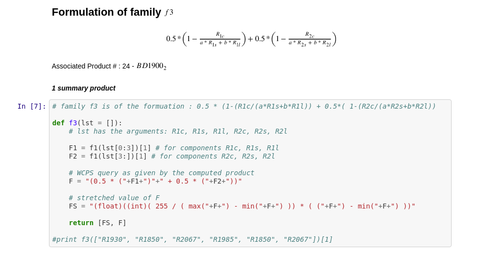

#### Family 4

R1330, R1080, R1506, R2529 and R3920 are family four. The formulation for family 4 is shown below.

#### Family 5

Family 5 has two members: IRR2 and IRR3.

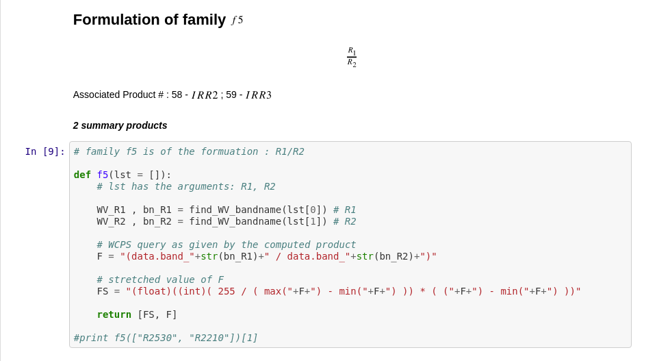

#### Family 6

Family 6 has only one member BD3000.

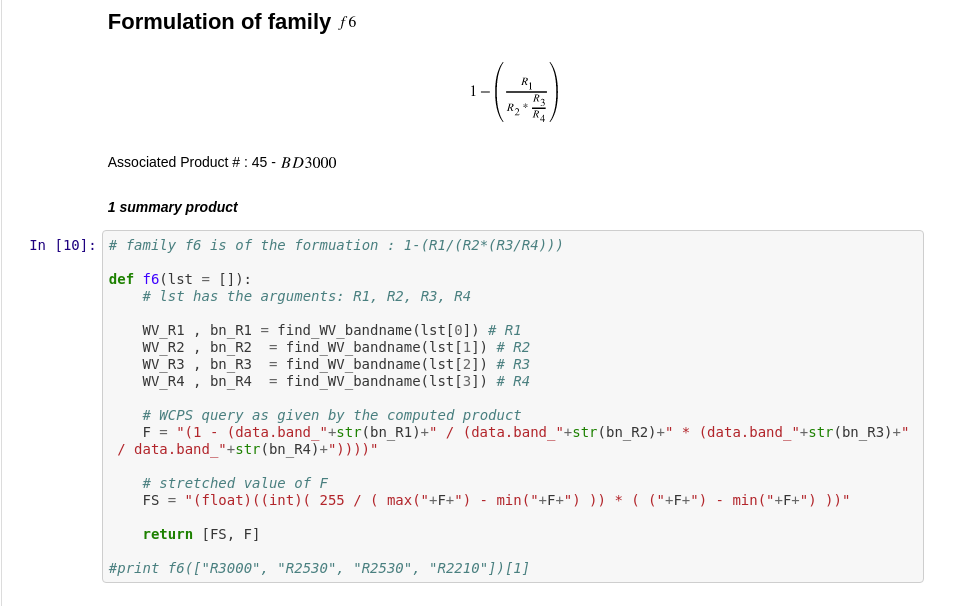

#### Family 7

Family 7 has SINDEX2 and CINDEX2.

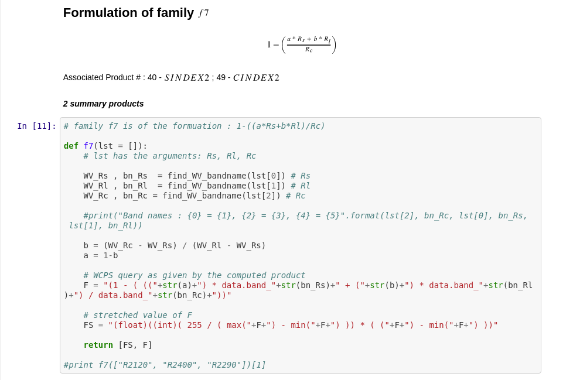

#### Family 8

Family 8 has ICER1_2 as one member. (it should be noted that ICER1_2 is listed after family 12)

#### Family 9

Family 9 has ISLOPE1 as only member.

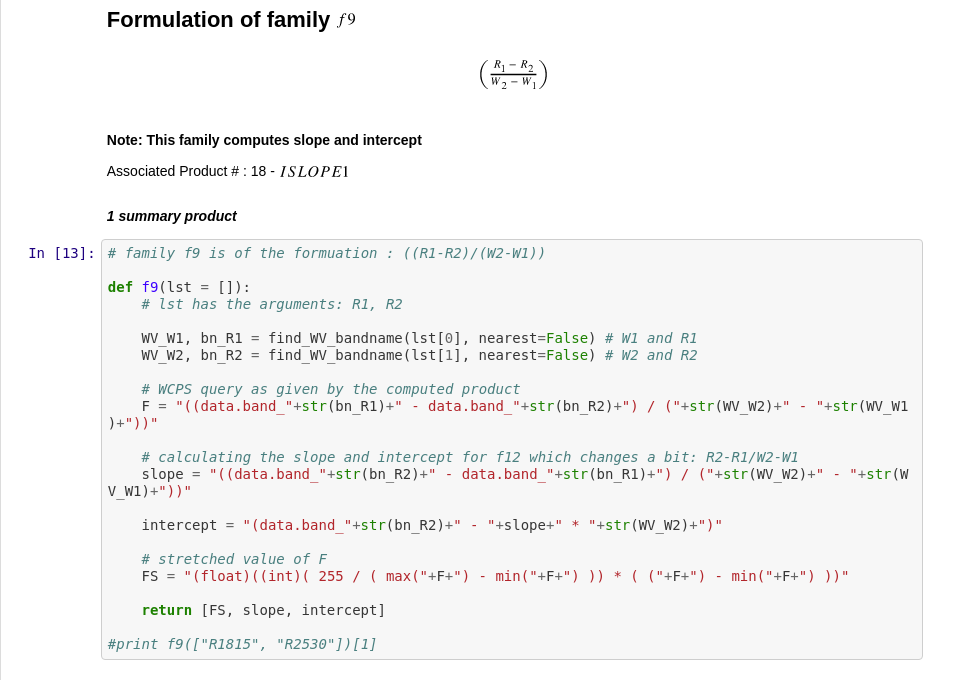

#### Family 10

ICER2_2 is the only member in family 10.

An extra family 10 is created to compute the absolute parameter for product OLINDEX3

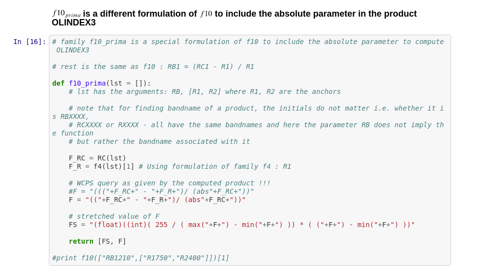

#### Family 11

Family 11 has several members: D2200, D2300, BD1900r2.

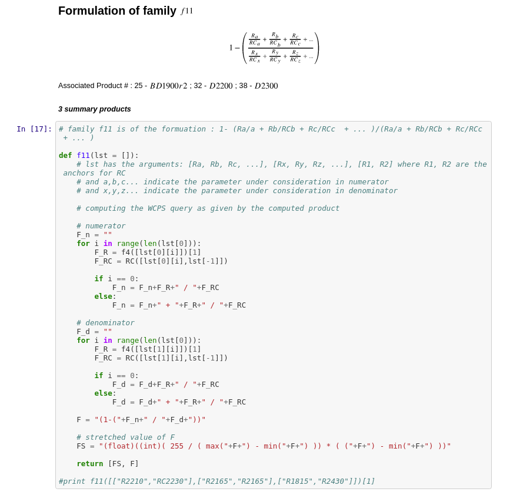

#### Family 12

Family 12 has LCPINDEX2 and HCPINDEX2 as members.

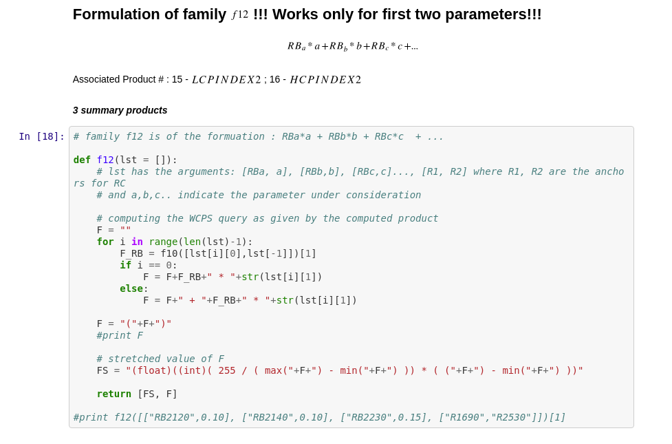

### Family 13

Family 13 is only used to compute OLINDEX3.

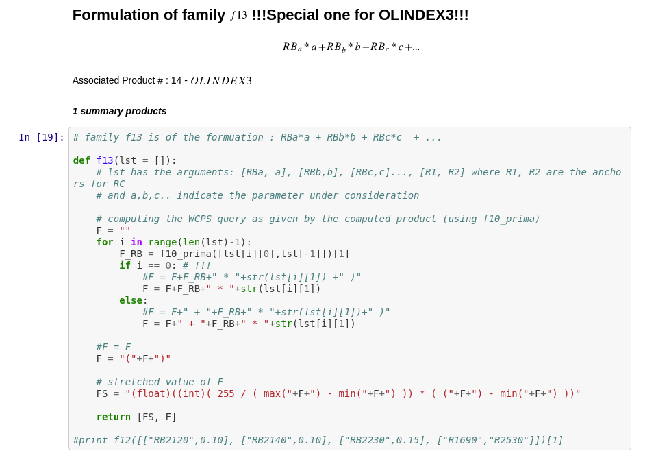

## How to use it

### RGB combination
Scroll down to the interface shows you 'User input and analysed image'.  

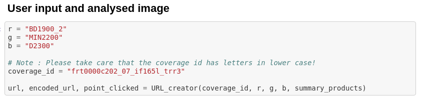

Choose r,g,b indices from following list (in this case we chose BD1900_2, MIN2200 and D2300 respectively) and the coverage name.

Run the interface 'User input and analysed image' and you should see output below the interface.  

In the method stated above, you should be able to get image by using this Python API for both 2.7 and 3.5 versions.

### Spectral Analysis tool

The spectral analysis tool on the notebook will show the spectra of a clicked point on the image. Please note that due to Jupyter's restrictions the cell is commented and needs to be uncommented in order to use it.

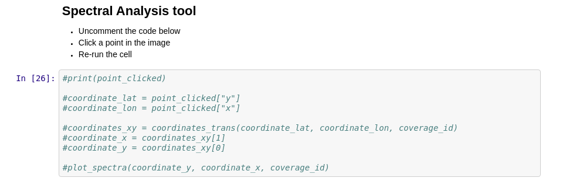

## Final Note

If there's any question regarding Python API or this tutorial, don't hesitate and leave a comment below the tutorial so that we can see and check how to deal with it.
