# Planet Server Client Tutorial

# Author
Keyuan Yin

# Change Log

|Version|Name|Note|
|---|---|---|
|1|Keyuan Yin|First created in Feb. 2017|
|2|Ramiro Marco Figuera|Update January 2018|

# Introduction

PlanetServer provides access to calibrated hyper- and multispectral, topographic data on Solar System bodies. The main focus is on Mars and the Moon. Under page www.planetserver.eu, you can access to the client server.(cited from PlanetServer webpage)  

PlanetServer is a Service component of the EC-funded EarthServer-2 project (#654367) aimed at serving and analyzing planetary data online, mainly through OGC Web Coverage Processing Service (WCPS). The focus of PlanetServer is on complex data, particularly hyperspectral imaging and topographic ones. Data from Mars, the Moon and other Solar System Bodies will be available and queriable.(cited from PlanetServer webpage)  

Person in charge:  

Project Manager - Dr.Angelo Pio Rossi  

Lead Developer - Ramiro Marco Figuera  

Solution Developer - Bang Pham Huu  

Junior Developer - Anik Halder, Keyuan Yin and Tsvetan Rankov  

CREDITS:  

CRISM data provided by PDS  

MOLA Base Map provided by USGS

# How To Use It

If this is your first time going to our site, you will be asked if you are willing to take a brief tour of PlanetServer. That tour gives you basic operations on PlanetServer.

If you have already done the tour you will land directly on the Client

This tutorial will go deeper than that pilot.

## Basemaps & Projections

On the right hand side of the page, you can click to expand the page. In this expanded page, you will first see projections and basemaps you can choose.  

First image shows you when I chose Mercator projection.  

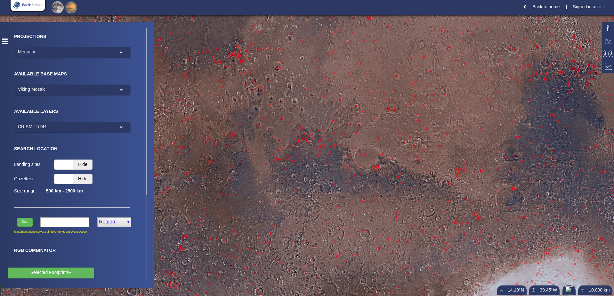

The second image shows you when I chose South Pole projection.  

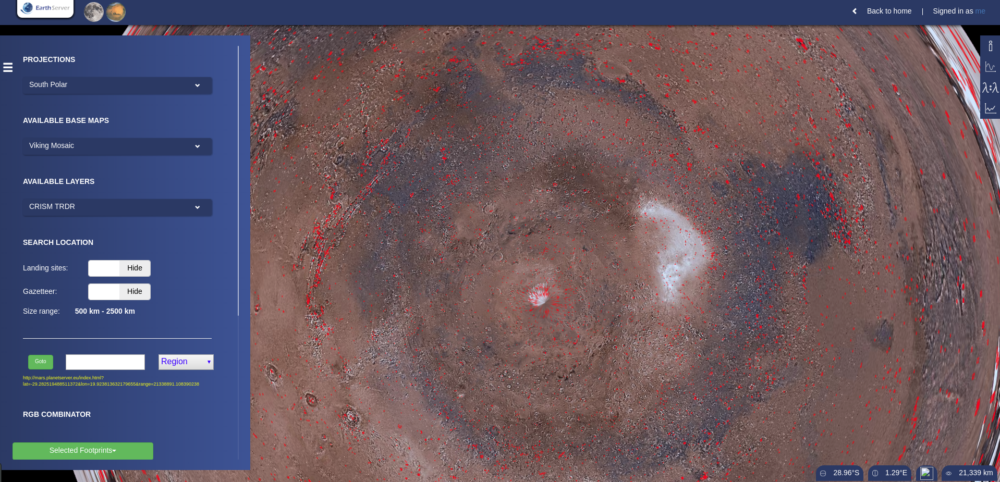

Full list of projections is presented below:  

3D, Equirectangular, Mercator, North Polar, South Polar, North Gnomonic, South Gnomonic, North UPS, and South UPS.  

2 basemaps you can choose are Viking Mosaic and MOLA Colored.  

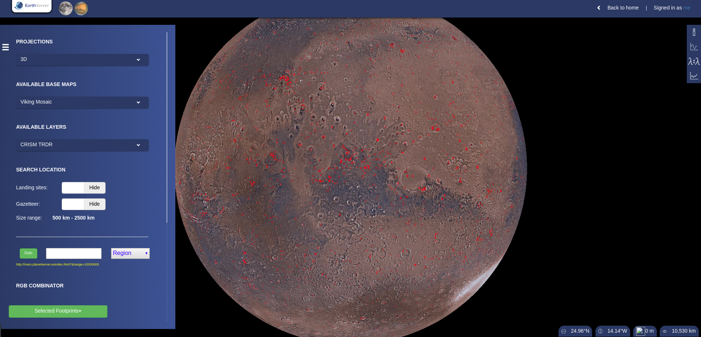

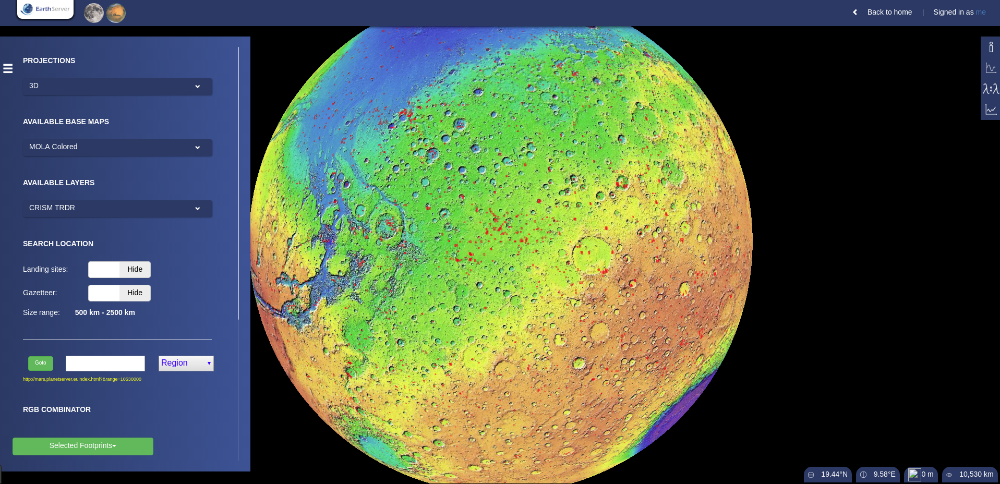

## Available Layers

At the moment two CRISM datasets are available on PlanetServer. CRISM TRDR images are fully working and the ones loaded by default. CRISM MRDR images are being tested and only a few images on the north pole are available.

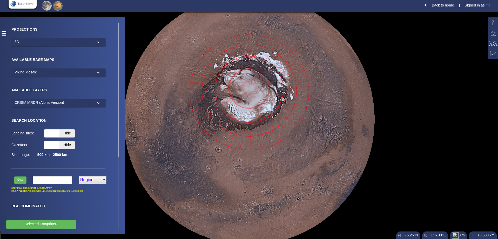

## Gazetteer and Landing sites

Gazetteer and landing sites on Mars are options available next to Basemap. Click on "show" and "hide" and you can see them or make them vanish on your map.

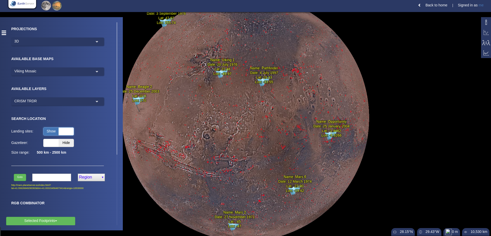

As you scroll closer to the surface, you can see more points with name on it. Gazetteer can be chosen and selected out using range bar.    

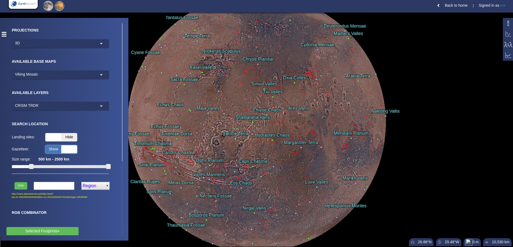

## Goto button

Using this button along with its three options, you can go to specific places on surface of Mars. You can either decide where to go via "region", "footprint" or "lat, lon".  

Using "Region" selection:  

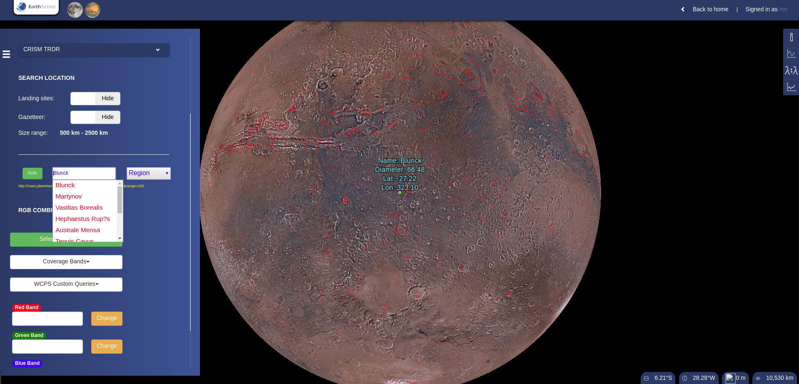

Using "footprint" selection:  

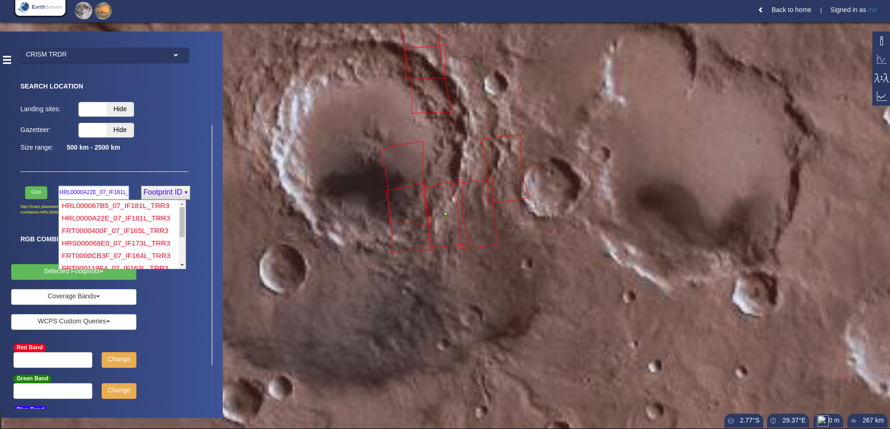

Using Latitude and Longitude:

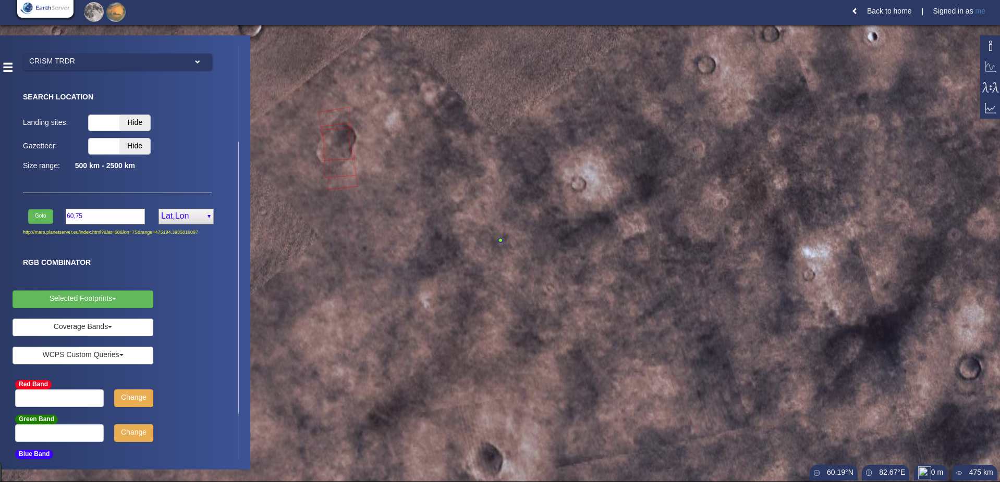

## RGB Combinator

First you need to select a footprint. After you select one footprint, the coverage will become a yellow circle.  

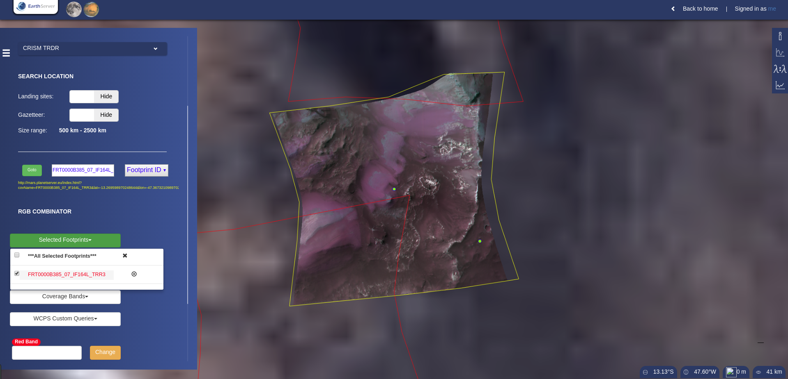

Then, you can choose combining method either using band or WCPS (CRISM product, see reference #1) queries.  

Using band:  

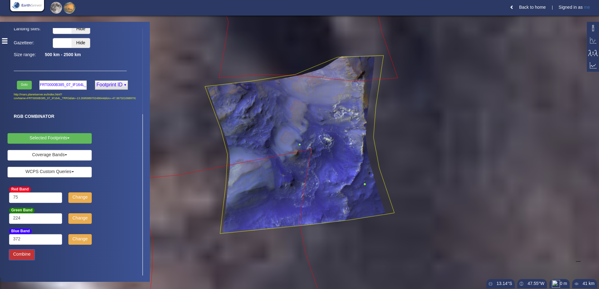

Using WCPS Queries:  

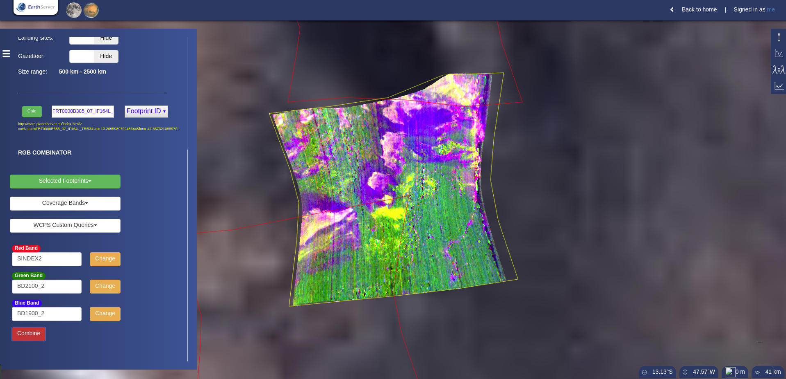

## Spectra Analysis & Spectra Ratio

On the right hand side of main page, you can find four buttons giving you general information of PlanetServer, spectra analyzing tool, spectra ratio tool and histogram tool.  

Single spectra and multiple point spectra can be shown in the chart:

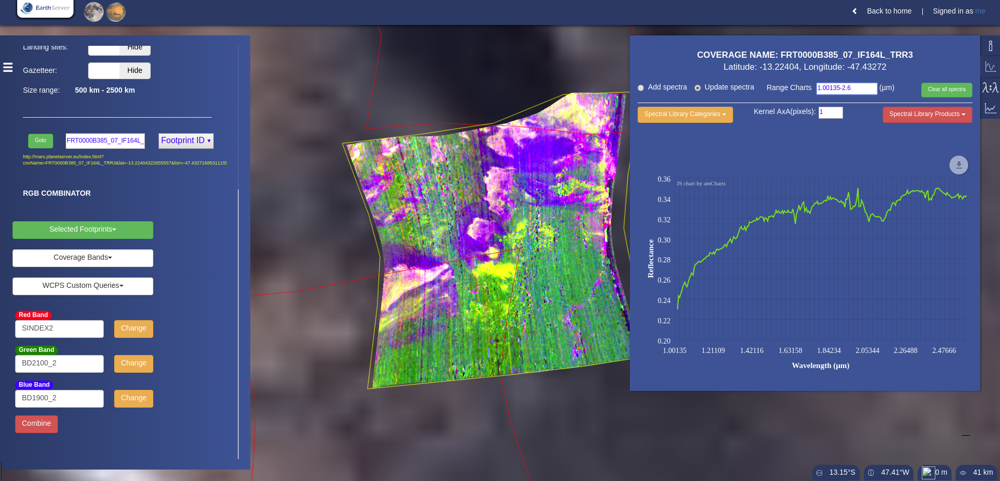

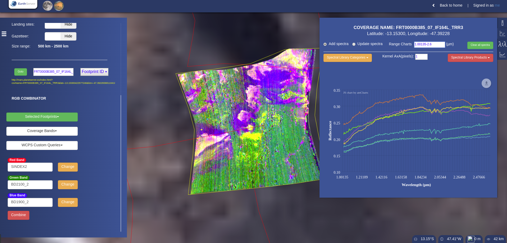

Also, you can take one of lab result by first choosing category and second choose specific material measurement from lab in order to compare materials on the points you previously chose.(lab product splib02a, see ref#2)  

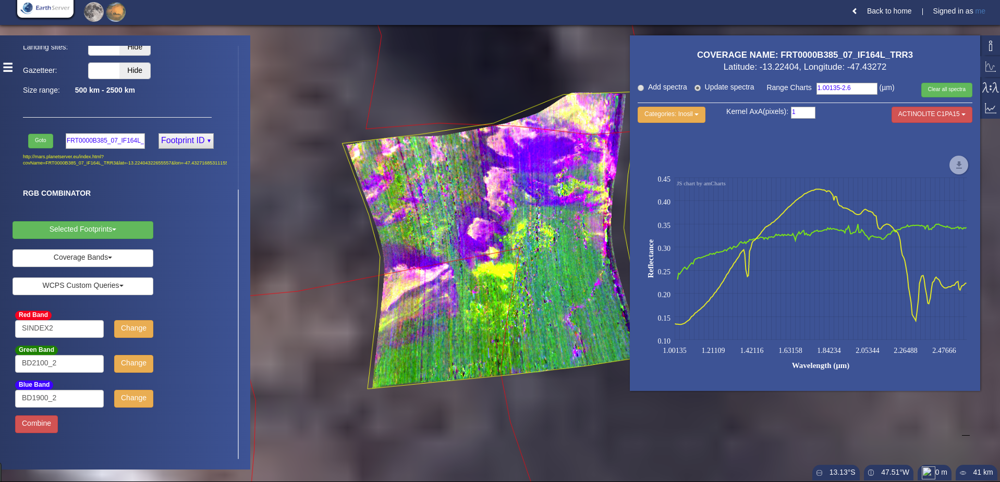

In third button, you can have the relative ratio of two points'.  

As you can see, your chosen numerator shown as red dot on the map and your chosen denominator shown as blue dot.  

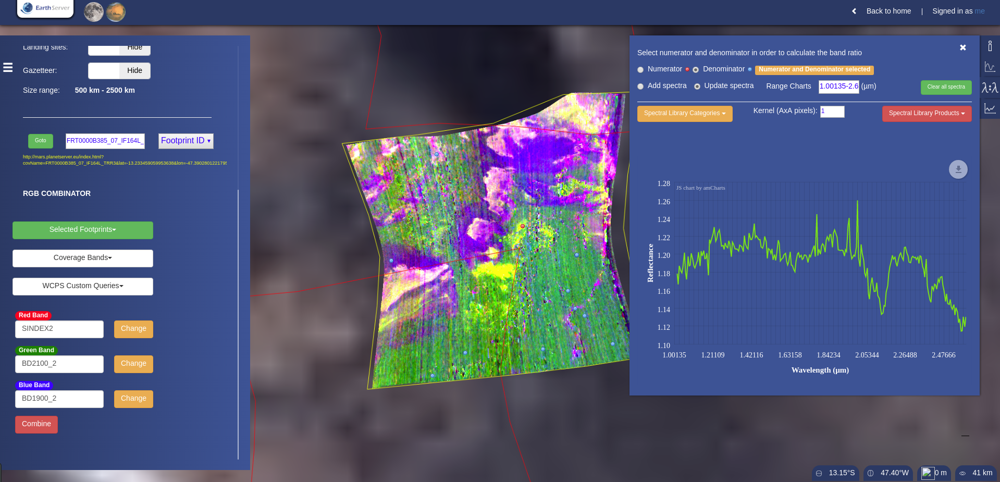

You can download the plot as PNG, PDF, JPEG, and SVG. Also, you can save it as CSV, XLSX, and JSON.

Right click on the coverage, you can see several options as well. You can either select on several coverages and unlock one coverage from several you previously chose.  

Download the coverage in GeoTiff or PNG form is also possible.  

## For Moon's PlanetServer

On the top of PlanetServer page, you can switch between Mars and Moon by clicking two planets on the left hand side of the bar. Clicking Moon will bring you to Moon's PlanetServer interface.  

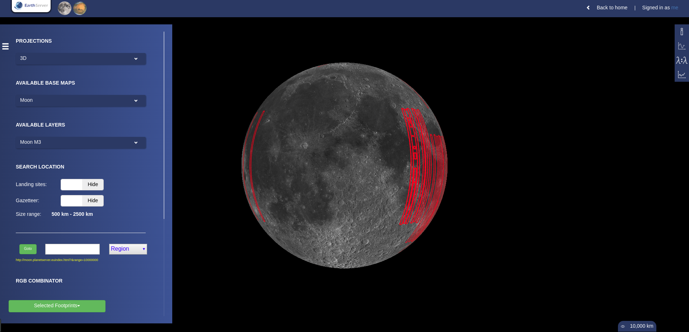

The functions of Moon PlanetServer are identical to those introduced in Mars PlanetServer.  

# References

#### 1
C. E. Viviano-Beck et al., “Revised CRISM spectral parameters and summary products based on the currently detected mineral diversity on Mars,” J. Geophys. Res. E Planets, vol. 119, no. 6, pp. 1403–1431, Jun. 2014.

#### 2
Clark, R. N., Swayze, G. A., Wise, R., Livo, K. E., Hoefen, T., Kokaly, R. F., & Sutley, S. J. (2007). USGS digital spectral library splib06a. US Geological Survey, Digital Data Series, 231.
